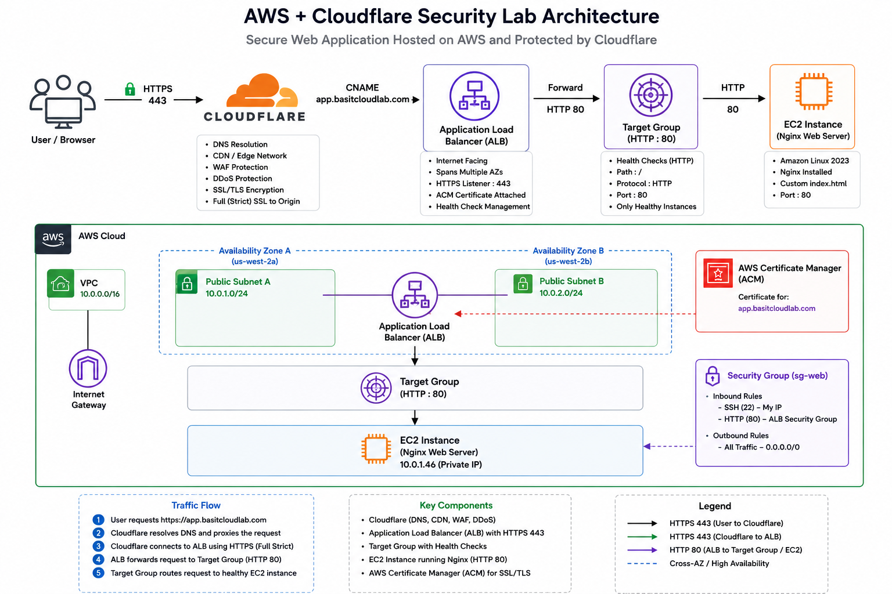

# AWS + Cloudflare Security Lab

## Project Overview

This project demonstrates how to deploy a production-style web application on AWS and secure it using Cloudflare. The goal was to build a web application behind an AWS Application Load Balancer (ALB), place Cloudflare in front of the application as the public-facing entry point, and secure all traffic using HTTPS with AWS Certificate Manager (ACM).

Unlike a basic EC2 web server deployment, this project introduces DNS management, load balancing, health monitoring, TLS/SSL encryption, Cloudflare proxy services, and real-world troubleshooting scenarios commonly encountered in production environments.

---

## Architecture Diagram

# Project Objectives

* Deploy an Nginx web application on AWS EC2
* Build custom VPC networking from scratch
* Configure public subnets and internet access
* Deploy an Application Load Balancer
* Configure Target Groups and Health Checks
* Integrate Cloudflare DNS and Proxy services
* Implement HTTPS using AWS Certificate Manager (ACM)
* Configure Cloudflare Full (Strict) SSL
* Validate end-to-end encrypted traffic
* Troubleshoot real-world connectivity and SSL issues

---

# Architecture Diagram below

Insert Architecture Diagram Image Here

Example Traffic Flow:

Internet User
|
v
Cloudflare DNS
|
v
Cloudflare Proxy
(DDoS Protection + WAF + TLS)
|
v
HTTPS (443)
|
v
AWS Application Load Balancer
|
v
Target Group Health Checks
|
v
EC2 Instance
Nginx Web Server

---

# Skills Demonstrated

AWS Services:

* VPC
* Subnets
* Internet Gateway
* Route Tables
* Security Groups
* EC2
* Application Load Balancer
* Target Groups
* AWS Certificate Manager (ACM)

Cloudflare Services:

* DNS Management
* Reverse Proxy
* SSL/TLS Management
* Cloudflare Proxy Services

Technical Skills:

* DNS Resolution
* HTTPS/TLS Encryption
* Load Balancing
* Health Monitoring
* Web Hosting
* Troubleshooting
* Cloud Security Concepts

---

# Initial Design

The original goal was to deploy a simple web application protected by Cloudflare.

Initial Architecture:

Internet User
|
Cloudflare
|
ALB
|
Target Group
|
EC2

At this stage:

* HTTP only
* No SSL certificate
* No HTTPS listener
* No encrypted traffic

The application successfully worked over HTTP.

---

# Environment Configuration

## VPC

Created custom VPC:

10.0.0.0/16

Purpose:

The VPC provides a dedicated private network for AWS resources.

---

## Public Subnets

Created two public subnets:

Public Subnet A:
10.0.1.0/24

Public Subnet B:
10.0.2.0/24

Purpose:

Application Load Balancers require at least two Availability Zones for high availability.

---

## Internet Gateway

Created and attached:

IGW

Purpose:

Provides internet connectivity for resources inside the VPC.

Without an Internet Gateway, traffic cannot enter or leave the VPC.

---

## Route Table

Created custom route table:

Destination:
0.0.0.0/0

Target:
Internet Gateway

Purpose:

Routes internet-bound traffic to the Internet Gateway.

Associated with both public subnets.

---

# EC2 Deployment

## Instance Configuration

AMI:
Amazon Linux 2023

Instance Type:
t2.micro

Purpose:

Hosts the Nginx web application.

---

## Security Group

Allowed:

SSH (22)
Source:
My Public IP

HTTP (80)
Source:
0.0.0.0/0

HTTPS (443)
Source:
0.0.0.0/0

---

# Nginx Installation

Installed Nginx:

sudo yum install nginx -y

Started Service:

sudo systemctl start nginx

Enabled Service:

sudo systemctl enable nginx

Verified Service:

sudo systemctl status nginx

---

# Custom Web Page

Modified:

/usr/share/nginx/html/index.html

Custom Page Content:

CLOUDFLARE SECURITY LAB

AWS + Cloudflare Protected Web Application

Purpose:

Provides visual confirmation that requests successfully reach the EC2 instance.

---

# Target Group Configuration

Created Target Group:

tg-cloudflare

Protocol:
HTTP

Port:
80

Registered Target:

web-server

Health Check Settings:

Protocol:
HTTP

Port:
80

Path:
/

Purpose:

Target Groups monitor application health and determine whether traffic should be routed to the EC2 instance.

---

# Application Load Balancer

Created:

alb-cloudflare

Configuration:

Internet Facing

Attached Subnets:

Public Subnet A
Public Subnet B

Listener:

HTTP : 80

Forward To:

tg-cloudflare

Purpose:

Provides a highly available entry point for incoming traffic.

---

# Cloudflare Integration

Created DNS Record:

app.basitcloudlab.com

Record Type:

CNAME

Target:

alb-cloudflare.amazonaws.com

Proxy Status:

Enabled (Orange Cloud)

Purpose:

Cloudflare becomes the public-facing entry point while hiding the AWS origin.

---

# Troubleshooting Journey

This project became significantly more valuable because multiple real-world issues were encountered and resolved.

---

## Issue #1

Website Not Loading

Problem:

The application could not be reached.

Root Cause:

Nginx was installed but not started.

Resolution:

sudo systemctl start nginx

Verification:

sudo systemctl status nginx

Result:

Website became reachable.

---

## Issue #2

Cloudflare 522 Error

Problem:

Cloudflare displayed:

Error 522
Connection Timed Out

Observation:

* Target Group Healthy
* ALB Healthy
* DNS Resolution Successful

Root Cause Investigation:

Direct access to the ALB worked.

This proved:

* EC2 healthy
* Target Group healthy
* ALB healthy

The issue was not AWS infrastructure.

---

## Issue #3

HTTP vs HTTPS

During troubleshooting it became clear that the environment was only using HTTP.

Although Cloudflare was functioning, the application lacked proper TLS encryption.

This led to researching production-grade HTTPS deployments.

---

# Implementing HTTPS

## AWS Certificate Manager (ACM)

Requested certificate:

app.basitcloudlab.com

Validation Method:

DNS Validation

Cloudflare automatically hosted the ACM validation CNAME record.

Certificate Status:

Issued

---

## HTTPS Listener

Added:

HTTPS Listener

Port:
443

Attached:

ACM Certificate

Forwarding:

HTTPS 443
|
v
Target Group

Purpose:

Allows encrypted communication between clients and AWS.

---

# Cloudflare SSL Configuration

Initial Mode:

Full

Updated Mode:

Full (Strict)

Purpose:

Cloudflare verifies that the origin server presents a valid certificate before establishing encrypted connections.

Benefits:

* End-to-end encryption
* Certificate validation
* Protection against man-in-the-middle attacks

---

# Final Architecture

Browser
|
HTTPS
|
Cloudflare
|
HTTPS
|
AWS Application Load Balancer
|
HTTP
|
Target Group
|
EC2
|
Nginx

SSL Termination occurs at the Application Load Balancer.

Traffic remains encrypted between:

Browser -> Cloudflare

and

Cloudflare -> ALB

---

# Validation Tests

## Test 1

Direct EC2 Connectivity

Result:
PASS

---

## Test 2

Nginx Service Verification

Result:
PASS

---

## Test 3

Target Group Health Checks

Result:
PASS

---

## Test 4

Application Load Balancer Access

Result:
PASS

---

## Test 5

Cloudflare DNS Resolution

Command:

nslookup app.basitcloudlab.com

Result:
PASS

---

## Test 6

ACM Certificate Validation

Result:
PASS

---

## Test 7

HTTPS Listener Verification

Result:
PASS

---

## Test 8

Cloudflare Full (Strict)

Result:
PASS

---

## Key Lessons Learned

* Cloudflare does not replace HTTPS.
* Cloudflare and AWS must be configured together correctly.
* ACM certificates are free and simple to deploy.
* Target Groups continuously monitor application health.
* Application Load Balancers provide stable, scalable entry points.
* DNS troubleshooting requires testing each layer independently.
* Direct ALB testing helps isolate Cloudflare-related issues.
* Production applications should always use HTTPS.

---

# Resume Bullet Points

* Designed and deployed a production-style web application on AWS protected by Cloudflare reverse proxy services.
* Built custom AWS networking using VPCs, public subnets, route tables, internet gateways, and security groups.
* Implemented Application Load Balancers, Target Groups, and health checks to provide scalable and resilient application delivery.
* Configured HTTPS using AWS Certificate Manager (ACM) and Cloudflare Full (Strict) SSL mode.
* Integrated Cloudflare DNS, proxy services, and TLS encryption to secure public-facing web traffic.
* Performed troubleshooting of Cloudflare 522 errors, service availability issues, and SSL/TLS configuration problems.
* Validated DNS resolution, certificate issuance, application health, and end-to-end encrypted communication.

---

# Future Enhancements

Potential improvements for future versions:

* AWS WAF Integration
* Cloudflare WAF Rules
* Auto Scaling Group
* CloudWatch Monitoring
* SNS Alerting
* Origin Lockdown
* Cloudflare Tunnel
* Cloudflare Load Balancing
* Multi-Region Disaster Recovery
* Route53 Failover Integration
* Transit Gateway Inter-Region Connectivity
* SSM Session Manager Access

---

# Conclusion

This project demonstrates how modern organizations protect public-facing applications using Cloudflare and AWS together. By combining Cloudflare proxy services, AWS Application Load Balancers, ACM certificates, and health monitoring, a secure and scalable web application architecture was successfully deployed and validated.

The project also provided hands-on experience troubleshooting real-world networking, DNS, and SSL/TLS issues, making it significantly more representative of production environments than a standard EC2 web server deployment.
